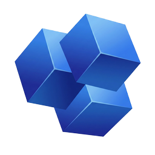

<p align="center">
  
</p>

<h1 align="center">CADHY</h1>

<p align="center">
  <strong>Computational Analysis & Design for Hydraulics</strong>
</p>

<p align="center">
  <a href="https://github.com/crhistian-cornejo/CADHY/releases"></a>
  <a href="https://github.com/crhistian-cornejo/CADHY/blob/main/LICENSE"></a>
  <a href="https://github.com/crhistian-cornejo/CADHY/actions/workflows/ci.yml"></a>
  
</p>

---

## What is CADHY?

CADHY is a **desktop application for designing and analyzing open channel hydraulic structures**. It combines a powerful CAD engine with hydraulic analysis tools, allowing engineers to model channels in 3D and perform hydraulic calculations in one integrated environment.

### Key Features

- **3D Channel Modeling** — Create rectangular, trapezoidal, and triangular open channels with real-time 3D visualization
- **Hydraulic Analysis** — Calculate normal depth, critical depth, Froude number, and flow characteristics using Manning's equation
- **Hydraulic Structures** — Design transitions, drops, chutes, and energy dissipation basins (USBR Types I-IV, SAF)
- **Water Surface Profiles** — Compute gradually varied flow (GVF) profiles using the Standard Step Method
- **CAD Export** — Export geometry to STL, OBJ, STEP, and glTF formats for use in other CAD software
- **Cross-platform** — Native apps for Windows, macOS, and Linux

### What CADHY Solves

Traditional hydraulic design requires switching between multiple tools: spreadsheets for calculations, CAD software for drawings, and separate programs for analysis. CADHY integrates these workflows into a single application where you can:

1. **Design** — Create channel geometry with engineering parameters (Manning's n, slope, dimensions)
2. **Analyze** — Run hydraulic calculations directly on your design
3. **Visualize** — See your channel in 3D with proper scale and proportions
4. **Export** — Generate CAD files ready for construction drawings or further analysis

---

## Screenshots

<p align="center">
  <picture>
    <source media="(prefers-color-scheme: dark)" srcset="apps/web/public/hero/dark.png">
    <source media="(prefers-color-scheme: light)" srcset="apps/web/public/hero/light.png">
    
  </picture>
</p>

---

## Installation

### Download

Get the latest release for your platform:

| Platform | Download | Notes |
|----------|----------|-------|
| Windows | [CADHY_x64-setup.exe](https://github.com/crhistian-cornejo/CADHY/releases/latest) | Full features |
| macOS (Apple Silicon) | [CADHY_aarch64.dmg](https://github.com/crhistian-cornejo/CADHY/releases/latest) | Full features |
| Linux | [CADHY_amd64.AppImage](https://github.com/crhistian-cornejo/CADHY/releases/latest) | Limited export* |

> **\*Linux Note:** Linux builds use system OpenCASCADE 7.5 which lacks glTF, OBJ, and PLY export. STL and STEP export work normally. Full Linux support coming in a future release.

### Build from Source

**Prerequisites:**
- [Bun](https://bun.sh/) 1.3+
- [Rust](https://rustup.rs/) stable
- [OpenCASCADE](https://dev.opencascade.org/) 7.5+ (via Homebrew on macOS, or download on Windows)

```bash
# Clone the repository
git clone https://github.com/crhistian-cornejo/CADHY.git
cd CADHY

# Install dependencies
bun install

# Run in development mode
bun dev

# Build for production
bun build
```

---

## Current Capabilities (v0.1.0)

### Channel Types
- Rectangular channels
- Trapezoidal channels
- Triangular channels

### Hydraulic Structures
- Channel transitions (width/shape changes)
- Hydraulic drops
- Chutes with energy dissipation:
  - Smooth surface
  - Stepped surface
  - Baffled chutes
  - Ogee crests
  - Converging walls
- Stilling basins (USBR Types I-IV, SAF)

### Analysis Tools
- Manning flow calculations
- Normal depth computation
- Critical depth computation
- Froude number classification
- Channel capacity verification with freeboard
- Water surface profiles (GVF)

### Export Formats
- STL (ASCII and Binary) — All platforms
- STEP (ISO 10303) — All platforms
- OBJ (Wavefront) — Windows/macOS only*
- glTF/GLB — Windows/macOS only*
- PLY — Windows/macOS only*

*See Linux note above regarding export limitations.

---

## Roadmap

Future versions will include:
- Circular sections (partially implemented in backend)
- Compound channels with bermas
- Sediment transport analysis
- Full GVF analysis with control structures
- Report generation
- More export formats

---

## Tech Stack

| Component | Technology |
|-----------|------------|
| Framework | [Tauri v2](https://tauri.app/) |
| Frontend | React 19, TypeScript, Tailwind CSS v4 |
| 3D Engine | Three.js + React Three Fiber |
| CAD Kernel | [OpenCASCADE](https://dev.opencascade.org/) 7.9.2 |
| Backend | Rust |

---

## Contributing

Contributions are welcome! Please read the contributing guidelines before submitting a pull request.

---

## License

MIT License - see [LICENSE](LICENSE) for details.

---

<p align="center">
  <sub>Built for hydraulic engineers who want better tools.</sub>
</p>
